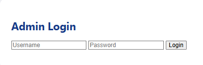
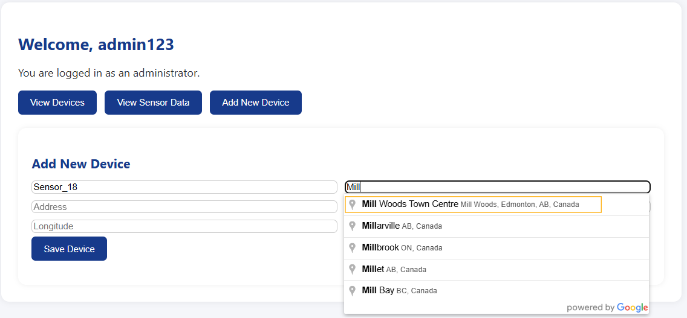
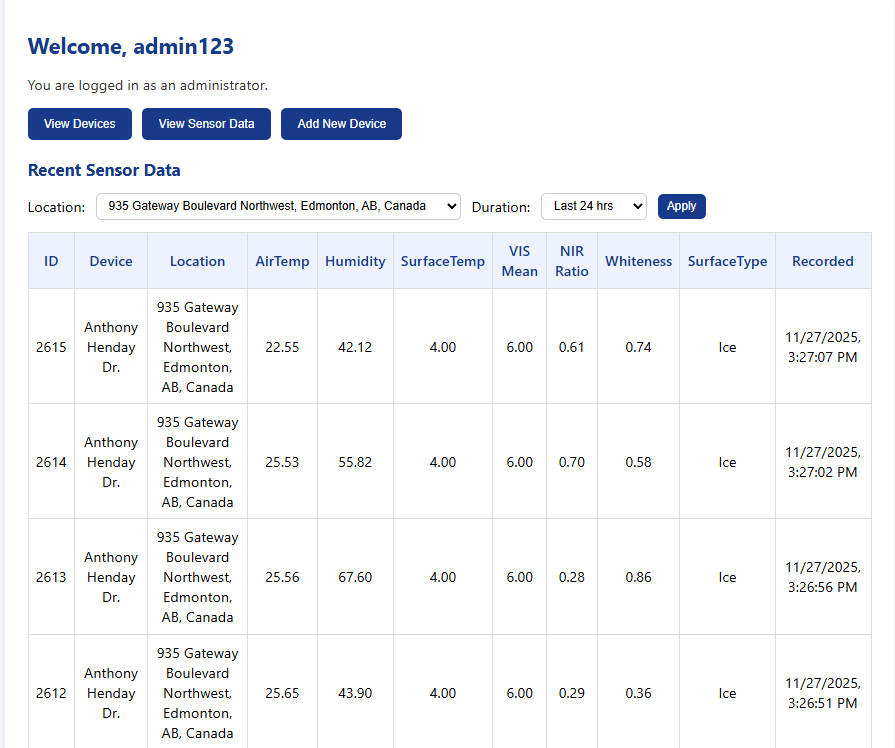
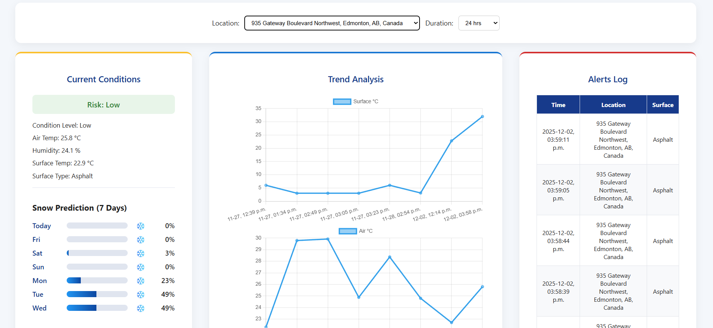
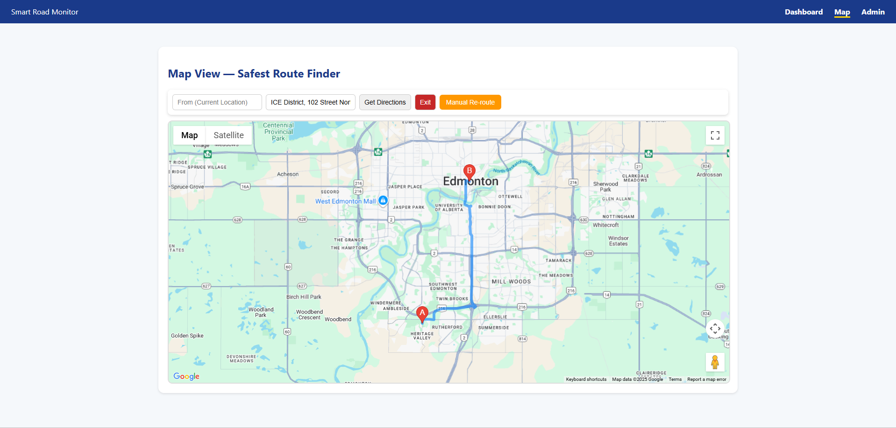
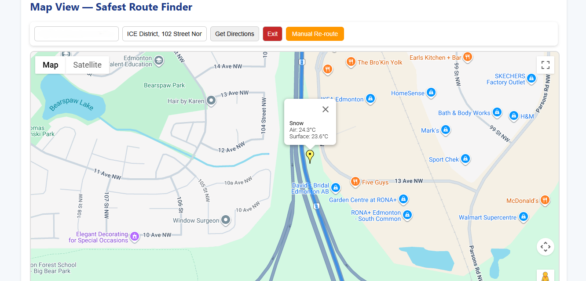
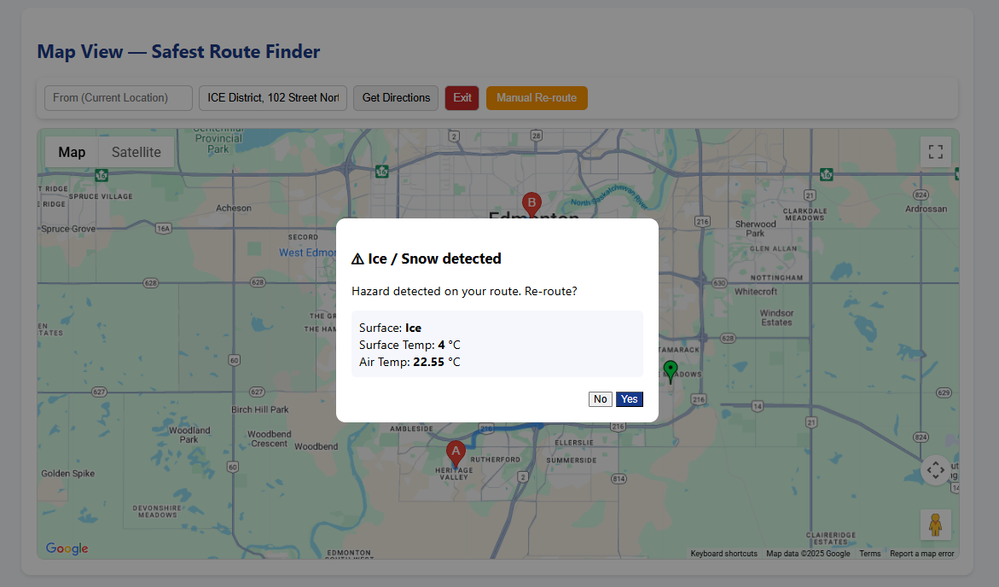
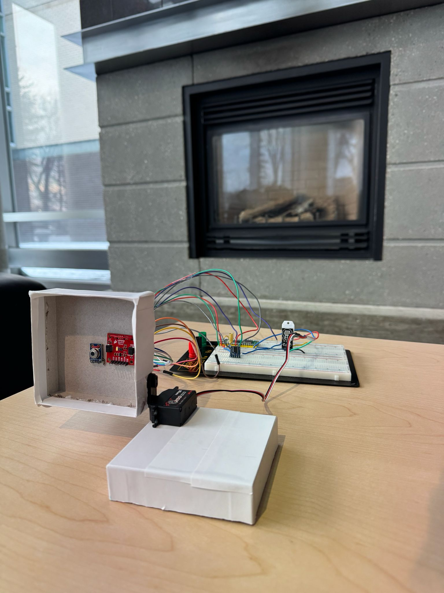

# Real-Time Sensor Monitor

A real-time road condition monitoring system built using IoT sensors, LoRa communication, C#(.NET) Core, SQL Server, and a web dashboard. The system collects sensor readings from a road-surface monitoring device, processes the data through a backend API, stores it in a database, and displays road condition insights on a dashboard.

## Overview

This project monitors road surface conditions such as snow, ice, and asphalt using real-time sensor data. The goal is to detect unsafe road conditions by using actual sensor readings instead of relying only on weather APIs.

The system uses hardware sensors to collect temperature, humidity, and spectral data. These readings are transmitted using LoRa communication and processed by an C# Core backend. The dashboard displays live sensor readings, risk levels, graphs, alerts, and map-based road condition information.

## Features

- Real-time sensor data monitoring
- Road condition detection for snow, ice, and asphalt
- LoRa-based sensor communication
- C#(.NET) Core backend
- SQL Server database integration
- REST API-based data processing
- Admin login
- Add and manage sensor devices
- View sensor readings
- Dashboard with graphs and risk indicators
- Google Maps integration
- Hazard alerts for unsafe road conditions
- Safe route finder

## Tech Stack

### Backend

- C#
- REST API
- Entity Framework Core
- SQL Server

### Frontend

- HTML
- CSS
- JavaScript

### IoT and Hardware

- Raspberry Pi Pico W
- MicroPython
- MLX90614 infrared temperature sensor
- DHT22 temperature and humidity sensor
- AS7343 spectral sensor
- REYAX RYLR998 LoRa module

### APIs

- Google Maps API
- Weather API

## System Flow

```text
Sensors
  ↓
Raspberry Pi Pico W
  ↓
LoRa Communication
  ↓
ASP.NET Core Backend
  ↓
SQL Server Database
  ↓
Web Dashboard
  ↓
Google Maps and Alerts
```

# 🔌 Hardware Layer

• Raspberry Pi Pico 2 W – Main controller  
• MLX90614 – Surface temperature sensor  
• DHT22 – Air temperature & humidity sensor  
• AS7343 – Spectral sensor (VIS Mean, NIR Ratio, Whiteness Index)  
• REYAX RYLR998 – LoRa communication module   

---

# 📡 Communication

• UART-based AT command LoRa communication  
• Long-range, low-power data transmission  
• Reliable packet forwarding to backend API  

---

# 🧠 Backend (ASP.NET Core)

• RESTful Web API  
• Entity Framework Core  
• SQL Server persistence  
• Device registration & management  
• Data filtering by location and duration  
• Risk classification logic  

---

# 📊 Dashboard Features

• Real-time sensor data retrieval  
• Surface classification display  
• Risk indicator (Low / Medium / High)  
• Trend analysis graphs (Air & Surface Temp)  
• Snow prediction integration  
• Historical data filtering  
• Alerts log tracking  

---

# 🗺 Map & Route Safety Features

• Google Maps API integration  
• Hazard marker placement  
• Ice / Snow detection popups  
• Re-route suggestion system  
• Safe route visualization  

---

``
# Project Screenshots

## 🔐 Admin Login


---

## ➕ Add New Device


---

## 📈 View Sensor Data


---

## 📊 Dashboard Overview


---

## 🗺 Safe Route Finder


---

## ❄️ Snow Detection on Map


---

## ⚠️ Ice / Snow Alert Popup


---

## 🔧 Hardware Setup


---

# 🎥 System Demonstration Videos

## ❄️ Snow Detection Demo  
👉 https://drive.google.com/file/d/1ZULd-0p43aBW0I14okI1I8ELuYCAlo_h/view?usp=sharing  

Demonstrates real-time snow surface classification using spectral analysis and temperature thresholds. Sensor data is transmitted via LoRa to the ASP.NET Core backend, stored in SQL Server, and dynamically retrieved by the dashboard for visualization and risk evaluation.

---

## 🛣 Asphalt Detection Demo  
👉 https://drive.google.com/file/d/1rHKsgJdqUam6YX8pnaBYdBoH8zzlfMwV/view?usp=sharing  

Shows successful detection of dry asphalt conditions using VIS mean, NIR ratio, and surface temperature metrics. Data is processed server-side and rendered in the dashboard, confirming safe road classification.

---

## 🧊 Ice Detection Demo  
👉 https://drive.google.com/file/d/1jodPWaOZ_VkF0dZx2FLKAaqb0sVeL8OQ/view?usp=sharing  

Illustrates hazardous ice detection triggered by low surface temperature and spectral reflectivity characteristics. The detected condition is transmitted over LoRa, persisted in the database, and immediately reflected in the dashboard with updated risk indicators and route hazard alerts.

---
```
## Setup Instructions

### 1. Clone the Repository

```bash
git clone https://github.com/hritikaphule/Real-Time-Sensor-Monitor.git
cd Real-Time-Sensor-Monitor
```

### 2. Open the Project

Open the solution file in Visual Studio:

```text
SmartRoadMonitor.sln
```

### 3. Install Requirements

Make sure you have the following installed:

- Visual Studio 2022
- .NET SDK
- SQL Server
- SQL Server Management Studio
- Git

Check the .NET version:

```bash
dotnet --version
```

### 4. Restore Dependencies

```bash
dotnet restore
```

### 5. Configure Database

Open `appsettings.json` and update the SQL Server connection string.

Example:

```json
{
  "ConnectionStrings": {
    "DefaultConnection": "Server=localhost;Database=SmartRoadMonitorDB;Trusted_Connection=True;TrustServerCertificate=True;"
  }
}
```

If you are using SQL Server username and password:

```json
{
  "ConnectionStrings": {
    "DefaultConnection": "Server=localhost;Database=SmartRoadMonitorDB;User Id=YOUR_USERNAME;Password=YOUR_PASSWORD;TrustServerCertificate=True;"
  }
}
```

### 6. Run Database Migration

```bash
dotnet ef database update
```

If `dotnet ef` is not installed:

```bash
dotnet tool install --global dotnet-ef
```

Then run:

```bash
dotnet ef database update
```

### 7. Add API Keys

If Google Maps or Weather API is required, add the keys in `appsettings.json`.

```json
{
  "GoogleMaps": {
    "ApiKey": "YOUR_GOOGLE_MAPS_API_KEY"
  },
  "WeatherApi": {
    "ApiKey": "YOUR_WEATHER_API_KEY"
  }
}
```

Do not commit real API keys to GitHub.

### 8. Run the Application

```bash
dotnet build
dotnet run --project SmartRoadMonitor
```

Or run it directly from Visual Studio.

The app will start on a local URL such as:

```text
https://localhost:5001
```

or

```text
http://localhost:5000
```

# 👨‍💻 Author

**Hritika Phule**  
